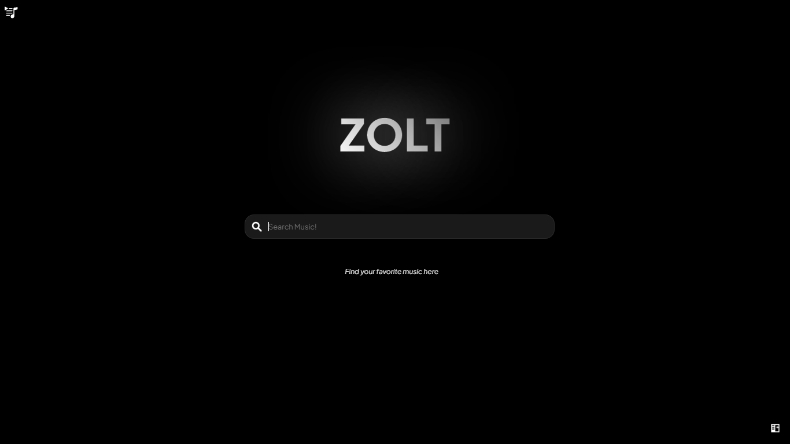
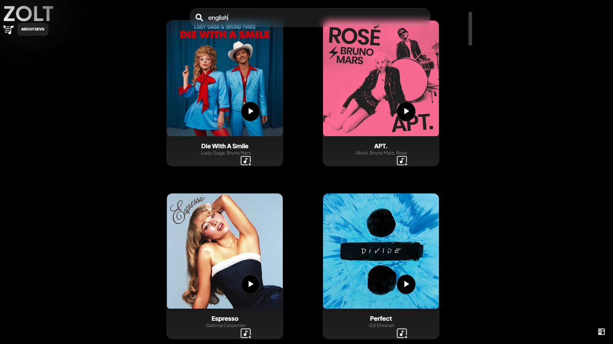

# ZOLT Music 🎵

Welcome to ZOLT Music - a modern, web-based music streaming platform that leverages the JioSaavn API to bring your favorite tunes to life.

## Overview

ZOLT Music is an open-source music streaming application built with vanilla JavaScript, HTML, and CSS. Our goal is to provide a seamless music listening experience with a clean, intuitive interface.

---

## Live Demo

**Experience ZOLT Music live at:** [https://zolt.netlify.app/](https://zolt.netlify.app/)




---

## Features

- 🌐 **Clean and modern user interface**
- 🎶 **Seamless music playback**
- ⚡ **Search functionality for tracks and artists**
- 🎨 **Responsive design for all devices**
- 🔗 **Integration with JioSaavn's open-source API**
- 🔷 **Dedicated credits page acknowledging all contributors**


---

## Technology Stack

- **HTML5**
- **CSS3**
- **Vanilla JavaScript**
- **JioSaavn API Integration**


---

## Project Structure

```plaintext
ZOLT/
├── CREDITS/              # Credits section
│   ├── credits.html     # Credits page layout
│   ├── style.css      # Styling for credits page
│   └── script.js       # Credits page functionality
│
└── HOME/                # Main application
    ├── index.html       # Main entry point
    ├── style.css        # Core application styles
    ├── script.js        # Core application logic
    └── playlistmanager.js  # Playlist handling functionality
```

---

## Installation

1. Clone the repository:
   ```bash
   git clone https://github.com/your-username/ZOLT.git
   ```

2. Navigate to the project directory:
   ```bash
   cd ZOLT
   ```

3. Open `index.html` in your preferred browser or use a local server.


---

## Contributing

We welcome contributions! Please feel free to submit a Pull Request.

---

### Contributors

<table>
  <tr>
    <td align="center">
      <a href="https://github.com/Parthsadaria">
        <br />
        <b>Parth Sadaria</b>
      </a>
    </td>
    <td align="center">
      <a href="https://github.com/HEETKUMBHARANA2369">
        <br />
        <b>Heet Kumbharana</b>
      </a>
    </td>
  </tr>
</table>

---

## License

This project is open source and available under the MIT License.


---

## Acknowledgments

- Special thanks to JioSaavn for providing their open-source API
- All our amazing contributors
- The open-source community


---

## Support

If you encounter any issues or have questions, please open an issue in the repository.

---

**Made with ❤️ by the ZOLT team**

